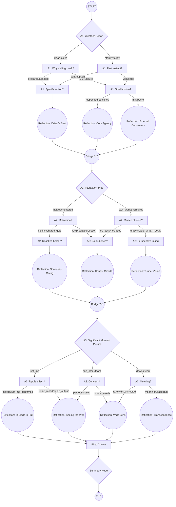

# The Daily Reflection Tree — Visual Diagram

This diagram shows the branching logic across the three axes: **Locus**, **Orientation**, and **Radius**.

```mermaid
graph TD
    START((START)) --> A1_OPEN{A1: Weather Report}
    
    %% Axis 1: Locus (Victim vs Victor)
    A1_OPEN -- clear/mixed --> A1_Q_AGENCY_HIGH[A1: Why did it go well?]
    A1_OPEN -- stormy/foggy --> A1_Q_AGENCY_LOW[A1: First instinct?]
    
    A1_Q_AGENCY_HIGH -- prepared/adapted --> A1_Q2_INTERNAL[A1: Specific action?]
    A1_Q_AGENCY_HIGH -- luck/unsure --> A1_Q2_EXTERNAL[A1: Small choice?]
    
    A1_Q_AGENCY_LOW -- control/push --> A1_Q2_INTERNAL
    A1_Q_AGENCY_LOW -- wait/stuck --> A1_Q2_EXTERNAL
    
    A1_Q2_INTERNAL --> A1_R_INTERNAL((Reflection: Driver's Seat))
    A1_Q2_EXTERNAL -- responded/persisted --> A1_R_MIXED((Reflection: Core Agency))
    A1_Q2_EXTERNAL -- maybe/no --> A1_R_EXTERNAL((Reflection: External Constraints))
    
    A1_R_INTERNAL --> BRIDGE_1_2((Bridge 1-2))
    A1_R_MIXED --> BRIDGE_1_2
    A1_R_EXTERNAL --> BRIDGE_1_2
    
    %% Axis 2: Orientation (Contribution vs Entitlement)
    BRIDGE_1_2 --> A2_OPEN{A2: Interaction Type}
    
    A2_OPEN -- helped/mentored --> A2_Q_CONTRIBUTION[A2: Motivation?]
    A2_OPEN -- own_work/uncredited --> A2_Q_ENTITLEMENT[A2: Missed chance?]
    
    A2_Q_CONTRIBUTION -- instinct/shared_goal --> A2_Q2_CONTRIBUTION[A2: Unasked helper?]
    A2_Q_CONTRIBUTION -- reciprocal/perception --> A2_Q2_MIXED[A2: No audience?]
    
    A2_Q_ENTITLEMENT -- too_busy/hesitated --> A2_Q2_MIXED
    A2_Q_ENTITLEMENT -- unaware/did_what_i_could --> A2_Q2_ENTITLEMENT[A2: Perspective taking]
    
    A2_Q2_CONTRIBUTION --> A2_R_CONTRIBUTION((Reflection: Scoreless Giving))
    A2_Q2_MIXED --> A2_R_MIXED((Reflection: Honest Growth))
    A2_Q2_ENTITLEMENT --> A2_R_ENTITLEMENT((Reflection: Tunnel Vision))
    
    A2_R_CONTRIBUTION --> BRIDGE_2_3((Bridge 2-3))
    A2_R_MIXED --> BRIDGE_2_3
    A2_R_ENTITLEMENT --> BRIDGE_2_3
    
    %% Axis 3: Radius (Self-Centric vs Altrocentric)
    BRIDGE_2_3 --> A3_OPEN{A3: Significant Moment Picture}
    
    A3_OPEN -- just_me --> A3_Q_SELF[A3: Ripple effect?]
    A3_OPEN -- one_other/team --> A3_Q_RELATIONAL[A3: Concern?]
    A3_OPEN -- downstream --> A3_Q_TRANSCENDENT[A3: Meaning?]
    
    A3_Q_SELF -- ripple_mood/ripple_output --> A3_R_EXPANDING((Reflection: Seeing the Web))
    A3_Q_SELF -- maybe/just_me_confirmed --> A3_R_SELF((Reflection: Threads to Pull))
    
    A3_Q_RELATIONAL -- shared/needs --> A3_R_RELATIONAL((Reflection: Wide Lens))
    A3_Q_RELATIONAL -- perception/self --> A3_R_EXPANDING
    
    A3_Q_TRANSCENDENT -- meaningful/abstract --> A3_R_TRANSCENDENT((Reflection: Transcendence))
    A3_Q_TRANSCENDENT -- rarely/disconnected --> A3_R_RELATIONAL
    
    A3_R_SELF --> A3_Q_FINAL[Final Choice]
    A3_R_EXPANDING --> A3_Q_FINAL
    A3_R_RELATIONAL --> A3_Q_FINAL
    A3_R_TRANSCENDENT --> A3_Q_FINAL
    
    A3_Q_FINAL --> SUMMARY{Summary Node}
    SUMMARY --> END((END))
```
